---
output:
    pdf_document:
        fig_caption: yes

bibliography: caller_paper.bib
---
# Targets
- Bioinformatics
- Plus Comp. Bio
- BMC bioinformatics
- Nature Scientific Reports.
- Genome Biology (published MuSE [@Fan2016])
- Nucleic Acids Research published EBCall in 2013

# Introduction

 <!-- Tumors are generally considered to arise from a single cell which acquires metastatic potential and is the ancestor of all cells in the tumor [@Nowell1976;@Fearon1989].
Clonal evolutionary processes are well studied in cancer [@Bozic2010;@Bozic2016], and the theory leads to three potential models for tumor evolution.
Tumors can evolve as a terminal expansion subject to little or no selective pressure, leading to a so-called *Big Bang* which is characterized by a large number of heterogeneous subclones[@Sottoriva2015].
Tumors evolving under selective pressure can have one of two dynamics: either they evolve in such a way that advantageous mutations arise and compete with each other leading to multiple dominant subclones in the tumor (branched evolution) [@Yates2012;@Gerlinger2012;@Burrell2013;@Bozic2016]; or they evolve such that each new advantageous mutation out-competes all previous mutations leading to a single dominant clone (sequential evolution) [@Hu2017].
These processes lead directly to the mutational profile of the tumor, i.e. mutations (variants), their genomic contexts, and their frequencies.

Identification of the mutations present in a tumor can be critical in optimizing the treatment regime for an individual patients disease [@Ding2012;@Mardis2012;@Chen2013;@Borad2014;@Findlay2016].
Low frequency mutations present a significant problem for current mutation calling methods because their signature in the data is difficult to distinguish from the noise introduced by NGS.
@Griffith2015 demonstrate conclusively that identification of all major resistance mutations present in a tumor is essentially impossible with current sequencing practice.
They find that rather than the current standard of sequencing a tumor exome at 75X-100X depth, sequencing of up to 400X is required to identify important subclonal mutations in a heterogeneous tumor.
In addition, they find that to identify the mode and tempo of evolution in a tumor, whole genome sequences of 300X are required [@Griffith2015].
Unfortunately, modern variant callers suffer from excessive false positive rates at extreme sequencing depths [@Cibulskis2013].
@Griffith2015 found that in order to generate a reliable set of variant calls for a whole genome sequenced at 312X depth they needed to combine the calls from eight different variant callers and then resequence 200,000 individual variants.

We analyzed data from 2 real tumor studies and 6 simulations.
I am completely stuck for intro so I just copied in from the proposal and moved on.
One of the important things to get across here is that we are really generating a score, not a true odds.
MuTect2 was released with a TLOD threshold of 5.3, corresponding to posterior odds of .3 which is much less than one. -->

Cancer is an evolutionary process, and understanding initiation, progression, and metastasis will require applications of evolutionary theory.
One of the major tools in the evolutionary theory toolbox is the allele frequency spectrum.
This allele frequency spectrum is constructed from single nucleotide variant calls in the tumor.

If tumors, as evidence suggests [@Williams2016;@Williams2018;@Bozic2016], evolve essentially neutrally, then even driver mutations can't be expected to rise to high frequency during tumor evolution.
As a result, finding mutations important to progression, resistance, and metastasis requires finding lower frequency mutations.
Tumor heterogeneity has been associated with prognosis (1-4 in chuang paper) and the evolutionary trajectory helps identify the number of tumor subclones and their selective advantage.

The variant allele frequency spectrum that is currently used most often in cancer is truncated at a level above 5-10% because of difficulties in identifying low frequency variants.

- There are two main tracks in variant calling.
    - Heuristic filters
    - Statistical models of sequencing error
- We focus here on a model of mutation probability, including but not limited to sequencing error.
- Many types of callers, all assume there is no biological preference for mutation at a given site. Any site specific estimates are site specific sequencing/alignment error models[@Xu2018]. 
- Mutect2, FreeBayes and others are haplotype based callers
- Callers with site specific variant probabilities generate them either from other samples or through deep sequencing (deepSNV,EBCall,LoLoPicker). They are essentially generating a site specific sequencing error model, not a site specific probability of mutation
- Need to think about how the method applies to UMI (barcode) based sequencing, which are mostly deep targeted
MuSE is continuous time markov evolutionary model, still assuming no biological difference in site specific mutation probability[@Fan2016]
- very little attention to the statistical model, either in competition or development
- there is useful biology.....
    - [@Temko2018] links between mutational processes and driver mutations
    - [@VandenEynden2017] mutational signature critical for estimating selection
    - [@Kandoth2013;@Alexandrov2013a] Underlying mutational processes generate tumor and tumor type specific mutation signatures
- Rather than using a constant probability for mutation, as other variant callers do, we convert that to an average or expected mutation probability, and compute the probability conditional on context and genome composition
- Poisson models make similar assumptions about the probability of an allele at a site. (Illumina technical note https://www.illumina.com/Documents/products/technotes/technote_somatic_variant_caller.pdf).
- we simulate neutral tumor evolution, and assign vafs using a Beta(1,6) distribution
    - if M(f) is proportional to 1/f, then an exponential distribution is implied [@Tarabichi2018;@Williams2017](and the answering note by De, which also has a strong argument about why we need lower frequencies to do evolutionary inference). We choose a beta distribution to draw vafs and tuned to achieve a slightly fatter distribution in the 2-5% range in which we are most interested.
- Need a list of why evolutionary inference on tumors is important. Resistance, virulence(heterogeneity), biology (mutation rate/signature/micro-environment).

# Results
## Precision - Recall
- Slightly worse in 100X WGS, and slightly better in 500X whole exomes
- Working on Data to see how the signature effects this
## Implementation

- Justification for using MuTect 1
  - Other callers probability model less accessible
  - MuTect 2 realignment step made RoC generation tough
- Mutect reports log likelihood ratio, which we convert to log odds
- You can see the reduction in MuTect2 threshold as a lowering of the delta_t or as an order of magnitude increase in the mutation rate.
- The same adjustment can be applied to our method (These might be discussion items)
- Algorithm complexity and speed


## Sensitivity and specificity in simulated data
In order to describe the operating characteristics of our score as a classifier compared to MuTect, we simulated NGS reads and called variants six tumor-normal pairs as described in Methods. We made three 100X whole genomes and three 500X whole exomes, with three differnent mutation spectra.
In WES simulations the relatively smaller number of variants, and consequent lower number of very low frequency variants, causes the methods to perform similarly, but our method is slightly more sensitive and has slightly higher AUROC than raw MuTect scores.
The large number of mutations present and at low frequency in whole genome simulations provide a clearer demonstration of the benefits of the method.
The portion of the ROC curve for our method is substantially higher than the curve for MuTect, and the MuTect curve is essentially linear, is due to the effect of the prior.
The prior is lowering scores of false positive mutations and raising the scores of true positives in this region. (This is super inelegant{bkm}).

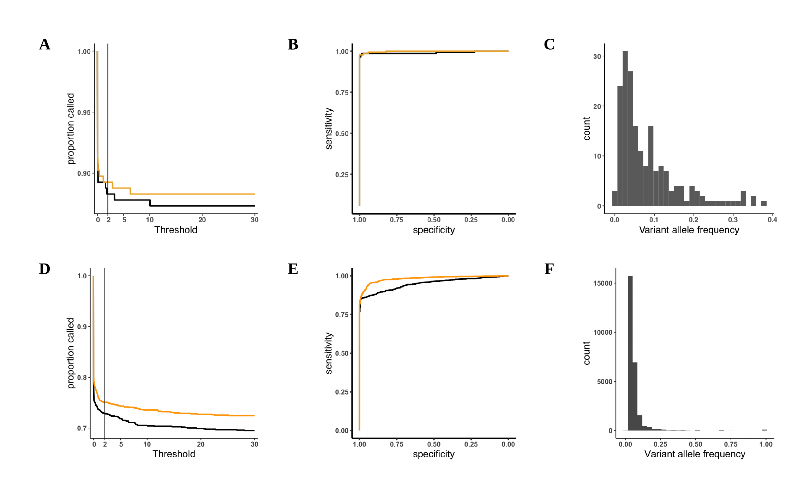


## Convergence of the prior to simulated target distributions.
In both whole genome (Figure 3) and whole exome (supplement) simulations, the estimated mutation spectrum is very close to the simulated spectrum. 
The conditional probability of mutation at a given site averaged over all sites is 3e-6 (the $P(m) = \mu$ used by MuTect; important that this is averaged over every site in the genome. The probability here includes estimates of the context content of the genome $P(m \mid C) = P(C \mid m)*P(m)/P(C)$), but our method overweights some contexts and underweights others in line with the data generating distribution.
(I think I need an exome too. I have the B figure, but need to generate the C figure{bkm})
 Supplementary figures for other target distributions? Or a different type of figure than we have here? Or something else?
 We get what we would expect with other simulated spectra. The prior is as sharp or diffuse as the data generating process.


- The performance of the method is always better, but the amount of benefit is directly tied to the concentration of the spectrum

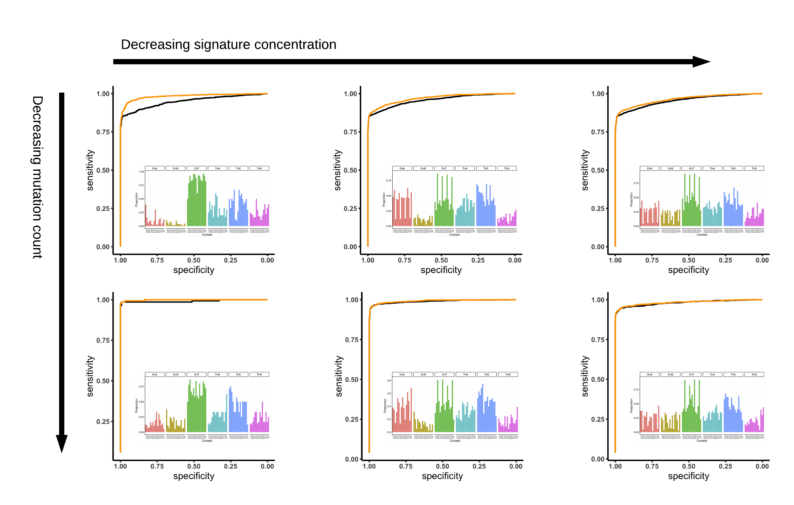

## Sensitivity in real data
We examined two real tumor datasets in which variants had been validated by deep targeted resequencing [@Griffith2015;@Shi2018]. 
@Griffith2015 performed whole genome sequencing of an acute myeloid leukemia to a depth of ~312X, called variants with seven different variant callers and validated over 200,000 variants by targeted re-sequencing to a depth of ~1000X. This led to a platinum set of variant calls containg 1,343 SNVs. 
We obtained BAM files from this experiment and called variants using MuTect 1.1.7, then compared the sensitivity of the calls between MuTect and our method (Figure 1A). 
At any relevant threshold our method is slightly more sensitive than MuTect. MuTect is unable to recover 100% of the calls due to hueristic filtering and other differences between MuTect and the other variant callers used.

@Shi2018 performed multi-region sequencing of 6 breast tumors to evaluate the effects of variant calling and sequencing depth on estimates of tumor heterogeneity, validating 1,385 somatic SNVs.
As with the leukemia we obtained BAM files for this experiment and compared our method to raw MuTect calls (Figure 1B).
We again find that our method is more sensitive than MuTect across the full range of relevant thresholds.


![Sensitivity in real tumors. A) AML31 platinum SNV calls [@Griffith2015]. B) Validated SNV in 6 breast cancers[@Shi2018].](figures/real_tumor_sensitivity.png)


# Discussion

- Must include a strong argument for better real tumor validation sets. Focus on false negatives as well as false positives.
The aml31 paper gets alot of them, but if they had for instance just used mutect to identify any potential variant that passed all other heuristic filters they would have a better sense of false negative rates.
- Why are false negative rates important?
  - heterogeneity
  - selection inference
  - rare but druggable variant identification
- Relevance to germline mutations, stratton citation in Things
- Standalone package, but approach really should be integrated into callers
- Computational efficiency if integrated
- Applicability to other algorithms for somatic variant calling
- Caveat: evolution of mutational spectrum (cite TrackSigs)


# Methods

## Algorithm

MuTect computes the probability of a mutation from reference allele $r$ to base $m$ as a function of base calls $b$, estimated allele frequencies $f$, and per base error probabilities $e$.
The probability that a given base is correctly called can be written as

$$
  P(b_i \mid e_i, r, m, f) = \left\{
    \begin{array}{cr}
      f \frac{e_{b_i}}{3} + (1-f)(1-e_{b_i}) & b_i = r\\
      f(1-e_{b_i}) + (1-f) \frac{e_{b_i}}{3} & b_i = m\\
      \frac{e_{b_i}}{3} & otherwise.
    \end{array}
    \right.
$$

Now consider two models for the data. Model $M_0$ in which there are no variants at a site, and $M^{m}_{f}$ where allele $m$ is present at allele fraction $f$.
Assuming reads are independent the likelihood of the model given the data is

$$
  \mathcal{L}(M^{m}_{f}) = P(\{ b_i \} \mid \{ e_{b_i} \}, r, m, f) = 
  \prod_{i=1}^{d} P(b_i \mid e_{b_i}, r, m, f)
$$

and the probability of $M^{m}_{f}$ can be written

$$ 
  P(m, f \mid \{ b_i \}, \{ e_{b_i} \}, r) = 
      \mathcal{L}(M^{m}_{f}) \frac{P(m,f)}{P({\{ b_i \}} \mid {\{ e_{b_i} \}}, r)}.
$$

We can also express this probability in terms of the model $M_0$

$$ 
  1 - P(m, f \mid \{ b_i \}, \{ e_i \}, r) = 
      \mathcal{L}(M_{0}) \frac{1 - P(m,f)}{P({\{ b_i \}} \mid {\{ e_{b_i} \}}, r)}.
$$

Taking the log of the ratio of the two previous equations gives the log odds in favor of $M^{m}_{f}$, and some cancellation yields

$$
  LOD_{T}(m,f) = \textrm{log}_{10} \left(\frac{\mathcal{L}(M^{m}_{f})P(m,f)}{\mathcal{L}(M^{m}_{0})(1-P(m,f))} \right).
$$

A classifier for variants is constructed by selecting an odds threshold $\delta_T$ and labeling variants satisfying the condition

$$
  LOD_{T}(m,f) = \textrm{log}_{10} \left(\frac{\mathcal{L}(M^{m}_{f})P(m,f)}{\mathcal{L}(M^{m}_{0})(1-P(m,f))} \right)
    \ge \textrm{log}_{10} \delta_T
$$
as true variants, and rejecting them otherwise.
Note that the expression for $LOD_{T}(m,f)$ can be further factorized as the sum of the log-likelihood ratio of the two models and the log odds of the prior for $M^{m}_{f}$.
Current variant callers calculate this prior by assuming the allele and its frequency are independent, and that $f \sim \textrm{U}(0,1)$, so that $P(f) = 1$.
If all substitutions are equally likely, then $P(m) = \mu/3$ where $\mu = 3 \times 10^{-6}$, the estimated per-base mutation rate in tumors.
Given these assumptions the log prior odds is a constant, and the classifier can be re-written as

$$
  LOD_{T}(m,f) = \textrm{log}_{10} \left(\frac{\mathcal{L}(M^{m}_{f})}{\mathcal{L}(M^{m}_{0})} \right) \ge
    \textrm{log}_{10} \delta_T - \textrm{log}_{10} \left(\frac{P(m)}{1 - P(m)} \right) \ge \theta_T.
$$

If $\delta_T = 2$, i.e the odds in favor of $M^{m}_{f}$ is 2, then $\theta_T = 6.3$, and this is the threshold implemented in MuTect 1. 

*Mutect 2 was released with a threshold of 5.3, implying odds much less than 1.(I have this calculation somewhere). This is made safer by using our method?*


The conditional probability that a mutation to allele $m$ will occur given a specific genomic context $C$, $P(m \mid C)$ can be computed from the empirical data in Figure \ref{fig2}, but $P(M \mid C)$ can not be.
Using Bayes rule we can rewrite$P(m \mid C)$ as

$$
  P(m \mid C) = P(C \mid m) \frac{P(m)}{P(C)}.
$$

Now $P(C \mid m)$ is the mutation spectrum of the tumor, $P(m) = \mu$, and $P(C)$ can be estimated as the frequency of context $C$ in the genome.
The new expression for the log odds is

$$
  LOD_{T}(m,f) = \textrm{log}_{10} \left(\frac{\mathcal{L}(M^{m}_{f})P(m \mid C)}{\mathcal{L}(M^{m}_{0})(1-P(m \mid C))} \right).
$$


## Variant allele frequency distribution
- The allele frequency spectrum of a particular tumor is determined by intrinsic factors including mutation rate and the action of natural selection.
- The theoretical neutral distribution is $M(f) \approx  1/f$ [@Bozic2016], which creates a roughly decreasing exponential shape on $[0,1]$ for allele frequency.
- We chose a Beta(1,6) distribution to simulate a roughly neutral evolutionary trajectory while providing a significant fraction of variants in the 1% - 5% range where discrimination is most difficult.
- 20% of variants have frequency between .017 and .057. 50% are less than .1

## Simulated tumors spectra
- 100X whole genome and 500X whole exome for each of three signatures
- Real mutations from TCGA and PCAWG
- 1,7,11 UV (Very concentrated at C>T)
- 1,4,5 Tobacco (Slight concentation at C>A and C>T)
- 1,3,5 Breast (diffuse)

# Simulated bam files
- 100X normal and 500X exome reads simulated with VarSim/art [@Mu2015] (default parameters?) and aligned with BWA [@Li2009a].(default parameters)
- Variants spiked with Bamsurgeon with default parameters [@Ewing2015a].
- Variants called with MuTect 1.1.7 with specific parameters [@Cibulskis2013]. (list them, just copy in as code is what I would prefer to see if I was reading the paper).
```
java -Xmx24g -jar $MUTECT_JAR --analysis_type MuTect --reference_sequence $ref_path \
        --dbsnp $db_snp \
        --enable_extended_output \
        --fraction_contamination 0.00 \
        --tumor_f_pretest 0.00 \
        --initial_tumor_lod -10.00 \
        --required_maximum_alt_allele_mapping_quality_score 1 \
        --input_file:normal $tmp_normal \
        --input_file:tumor $tmp_tumor \
        --out $out_path/$chr.txt \
        --coverage_file $out_path/$chr.cov
```
- Variants identified by MuTect are labelled as to whether they pass all MuTect filters, pass all filters *other* than the evidence threshold `tlod_f_star`, or fail to pass any filter other than `tlod_f_star`. Variants that pass all filters or fail only `tlod_f_star` are then passed to {method} for prior estimation and rescoring.

# Figures

<!-- 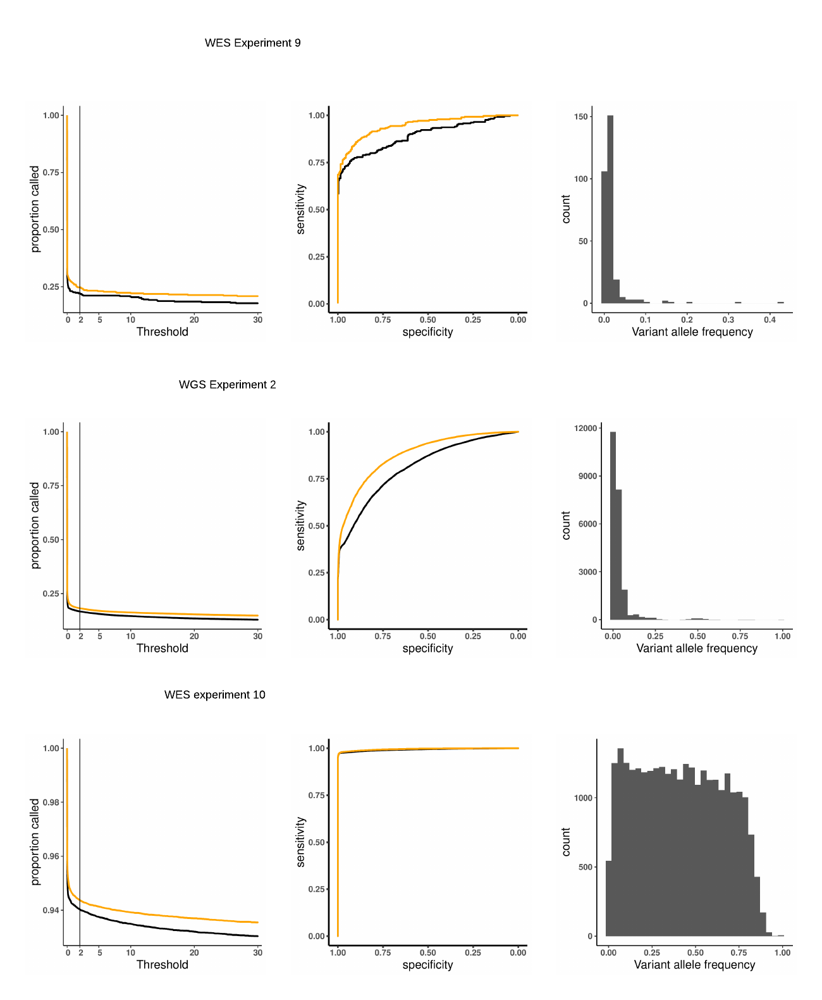

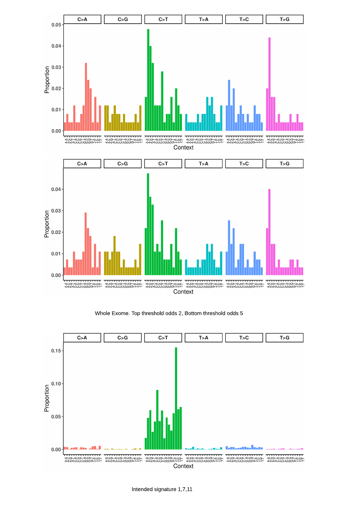

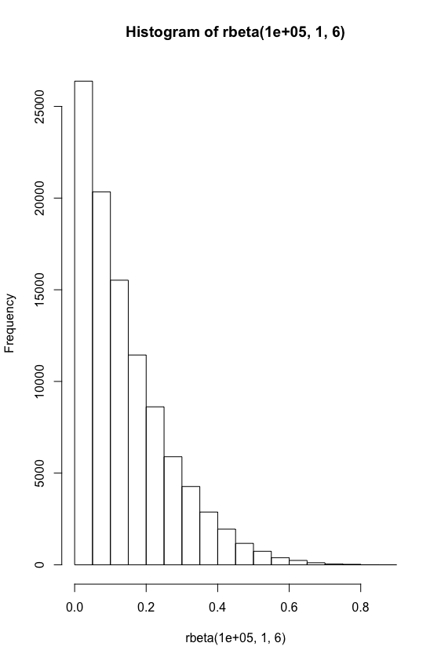
Figure 1 - aml31 no downsample roc


Figure 2 - aml31 no downsample fraction called

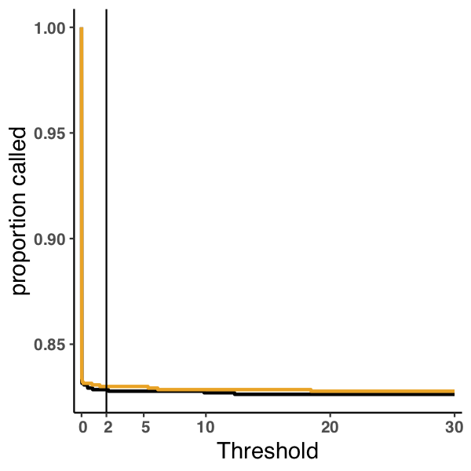

Figure 2a - aml31 no downsample vaf

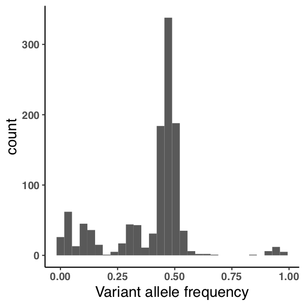

Figure 3 - aml31 50 percent downsample roc

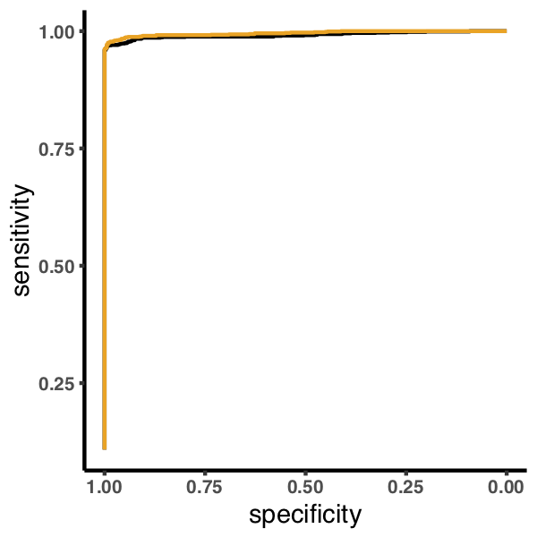

Figure 4 - aml31 50 percent downsample fraction called

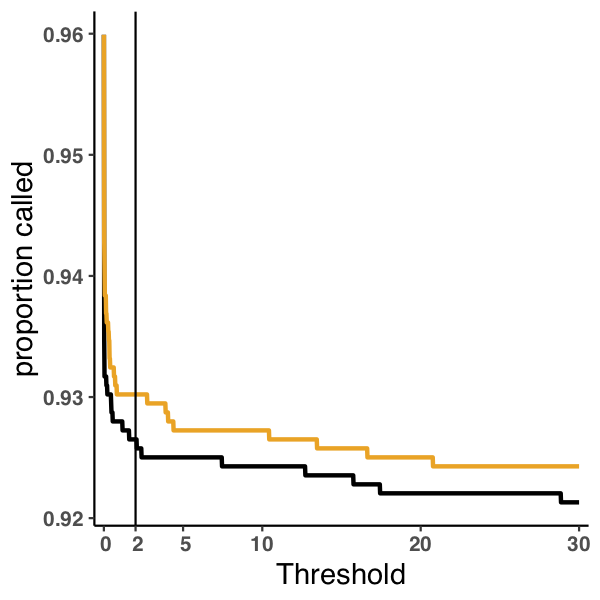

Figure 4a - aml31 50 percent downsample vaf


Figure 5 - aml31 25 percent downsample roc

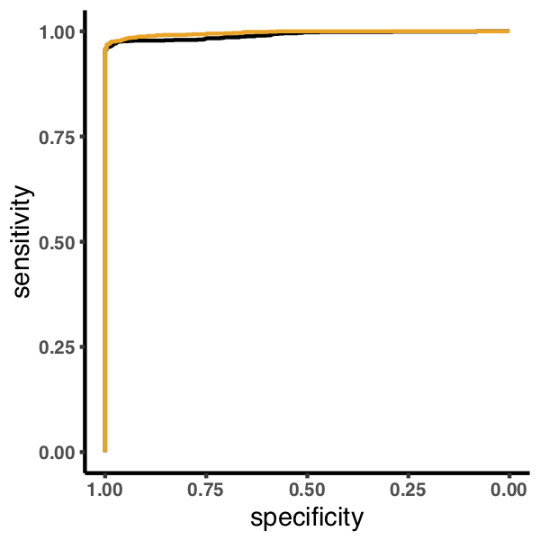

Figure 6 - aml31 25 percent downsample fraction called

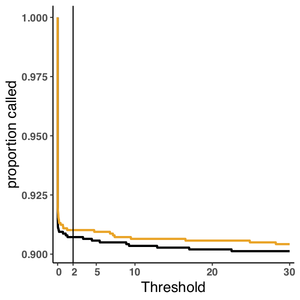

Figure 6a - aml31 25 percent downsample vaf

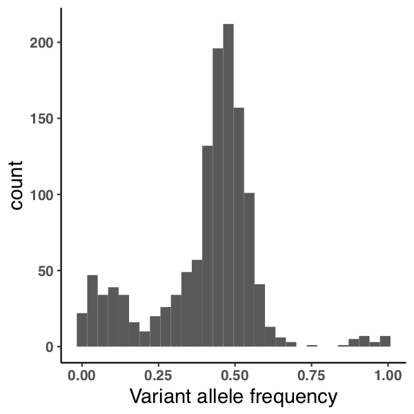

Figure 7 - cell paper roc

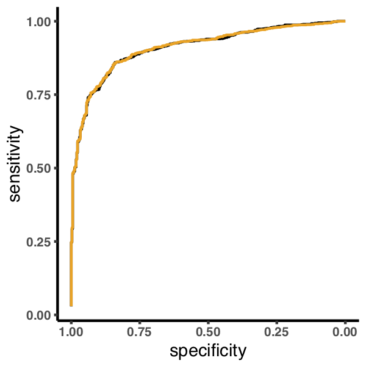

Figure 8 - cell paper fraction called

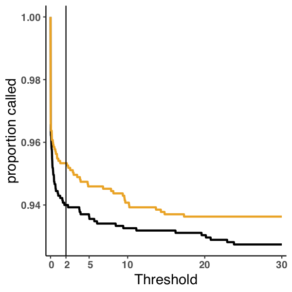

Figure 8a - cell paper vaf

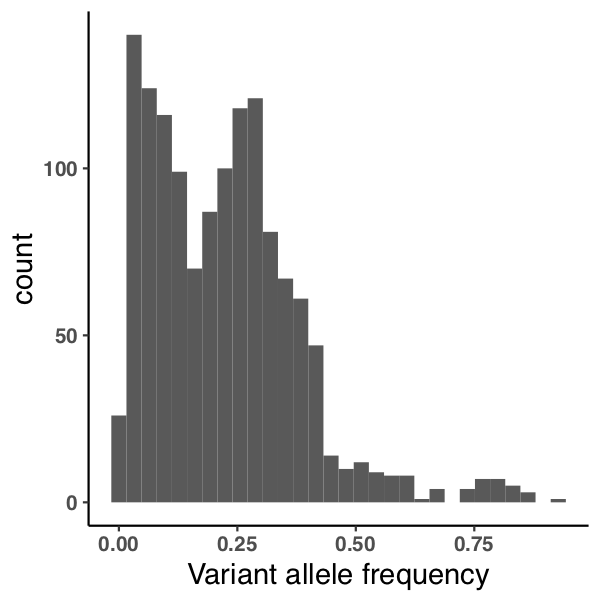


<!-- Figure 9 - experiment 2 roc

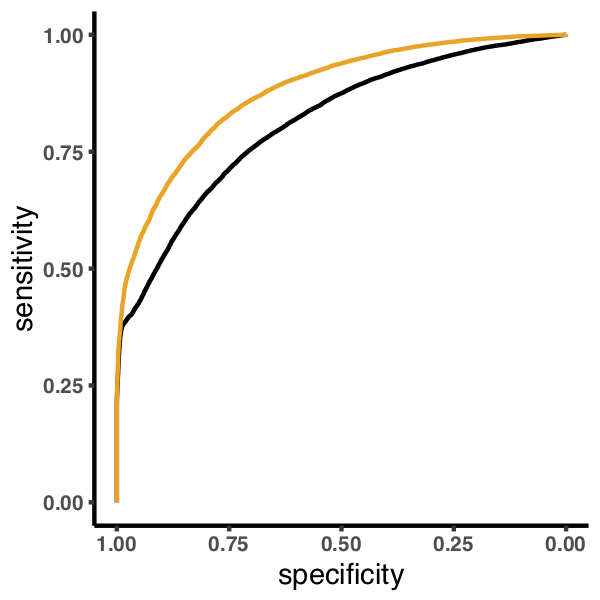

Figure 10 - experiment 2 fraction called
 -->
<!-- 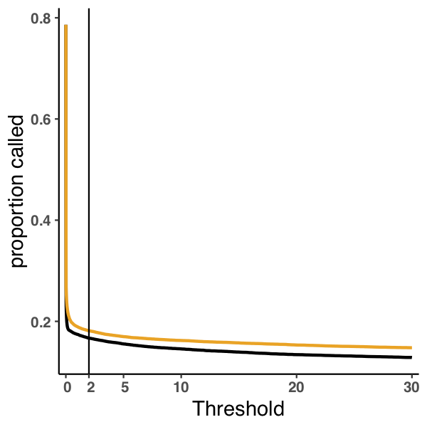

Figure 10a - experiment 2 vaf

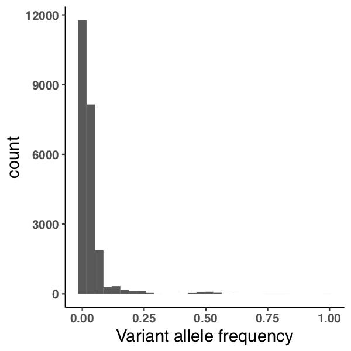


Figure 11 - experiment 10 (uniform vaf) roc

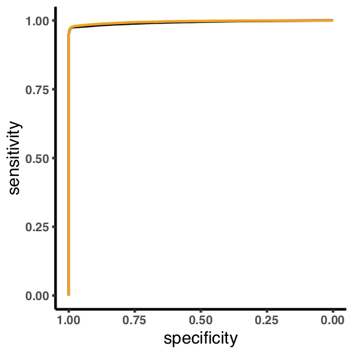

Figure 12 - experiment 10 (uniform vaf) fraction called

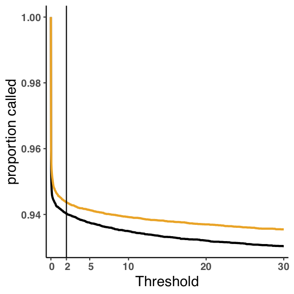

Figure 12a - experiment 10 (uniform vaf) vaf

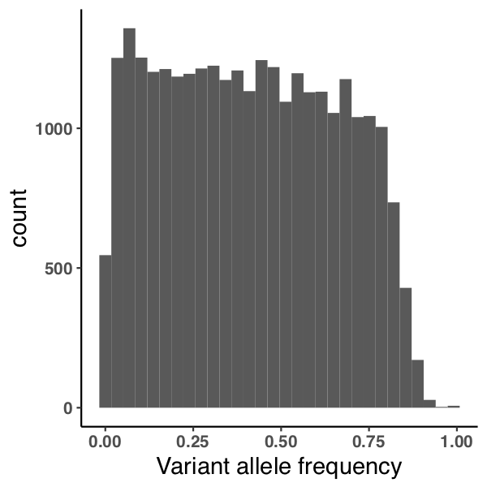 -->

# References