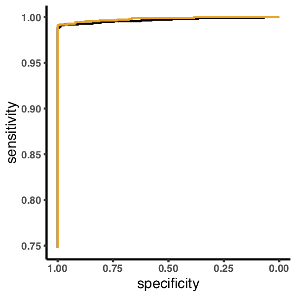

---
output:
    pdf_document:
        fig_caption: yes
---
# Results

## Sensitivity and specificity in simulated data
1. Brief description of simulations, see methods
2. Words about the figure
    - What is the linear regime in the Mutect ROC curves about?
    - Is it related to the uniform prior, and does it give a good explanation of the performance difference?

## Sensitivity in real data
We examined two validation datasets from real tumors. An acute myeloid leukemia whole genome was sequenced to average coverage of 365X, and over 200,000 mutations validated by deep sequencing. In addition to the full dataset we also called mutations on two downsample datasets, one retaining 50% of the original reads and one retaining 25%. ROC curves were generated using the authors "platinum" calls as cases, and sites where validation sequencing depth was greater than 100X and no variant reads were found as controls. Both algorithms perform similarly and nowhere along the curve is the {what is the name of this thing} method below raw mutect calls. The {method} calls a higher fraction of platinum calls at every odds threshold, and is especially effective at the common threshold of 2:1 odds in favor of the mutation.

***Going to need a table of AUROCs in the supplement for this***

## Effect of number of mutations

1. How to approach this?
   - At what point does the empirical make more sense than the dirichlet.
   - I think never, they will converge
   - What is the stopping point with a low number of high confidence mutations
   - Implementation of the dirichlet should let us create an estimation of total error between the final empirical at a given threshold and the dirichlet at every point in the process. Maybe a plot of this?

## Effect of variant allele frequency distribution
1. TCGA data for different distributions.
   - Different cancer types?
   - Hypermutators vs. not?
   - This should only be related to the number of mutations that are confident and contribute to the prior
   - If that is the case, is there an analytical way to better describe this?

# Methods
VScode is great for markdown

# Figures
Figure 1 - aml31 no downsample roc

Figure 2 - aml31 no downsample fraction called

Figure 3 - aml31 50 percent downsample roc

Figure 4 - aml31 50 percent downsample fraction called

Figure 5 - aml31 25 percent downsample roc

Figure 6 - aml31 25 percent downsample fraction called

Figure 7 - cell paper roc

Figure 8 - cell paper fraction called

Figure 9 - experiment 2 roc

Figure 10 - experiment 2 fraction called

