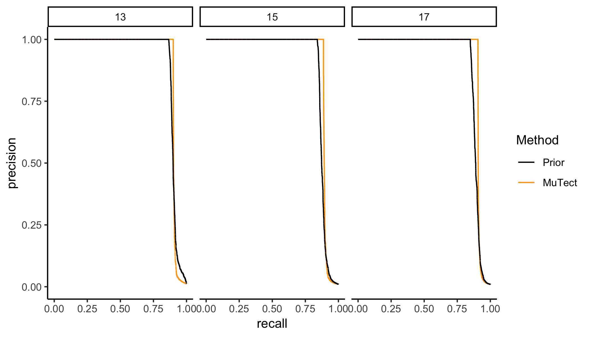
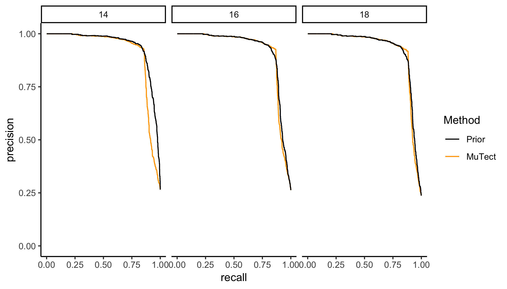
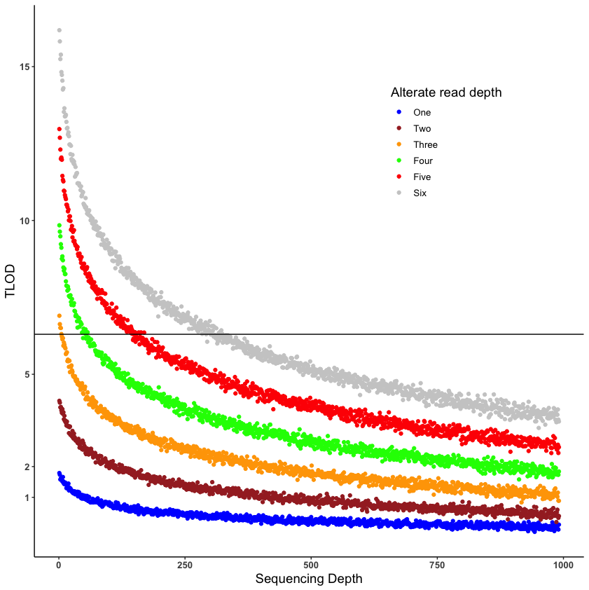
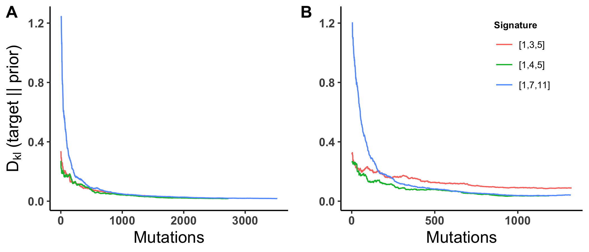

---
output:
    pdf_document:
        fig_caption: yes

bibliography: caller_paper.bib
---
# Targets
- Nucleic Acids Research published EBCall in 2013
- BioinformaticEmprical Bayes estimate of the posterior probability of mutation
- NAR has a brand new genomics and bioinformatics journal

# Introduction

Cancer develops as the result of the accumulation of somatic mutations and clonal selection of cells with mutations that confer a selective advantage on the cell.
Understanding the forces that shaped the evolutionary history of a tumor, the mutations that are responsible for its growth, the rate at which mutations are occurring, or how much genetic diversity is likely present in the tumor, requires accurate variant calling, particularly at low variant allele frequency [@Williams2016;@Bozic2016;@Williams2018].
Accurate variant identification is also critical in optimizing the treatment regime for an individual patients disease [@Ding2012;@Mardis2012;@Chen2013;@Borad2014;@Findlay2016].
Low frequency mutations present a significant problem for current mutation calling methods because their signature in the data is difficult to distinguish from the noise introduced by Next Generation Sequencing (NGS), and this problem increases as sequencing depth increases.

Methods for identifying true somatic mutations - i.e. variant calling -  from NGS data are an active area of research in bioinformatics.
The earliest widely used somatic variant callers aimed specifically at tumors, Mutect1 and Varscan2, used a combination of heuristic filtering and a model of sequencing errors to identify and score potential variants, setting a threshold for that score designed to balance sensitivity and specificity [@Koboldt2012;@Cibulskis2013].
Subsequent research gave rise to a number of alternate variant calling strategies including haplotype based callers [@Garrison2012],
joint genotype analysis (SomaticSniper, JointSNVMix2, Seurat, and CaVEMan,MuClone)[@Larson2012;Roth2012a;@Christoforides2013;@Jones2016;@Dorri2019], allele frequency based analysis (Strelka, MuTect, LoFreq, EBCall, deepSNV, LoLoPicker, and MuSE)[@Saunders2012;@Wilm2012;Shiraishi2013b;Gerstung2012;@Carrot-Zhang2017;@Fan2016], and a mixture of ensemble and deep learning methods (MutationSeq, SomaticSeq, SNooPer, and BAYSIC).
All of these methods have varying levels of complexity, and some are focused on specific types of data.
The one thing they all have in common is that they either implicitly or explicitly assume that the probability of a mutation occuring at a give site is proportional to the overall mutation rate, and the same at every site in the genome.

Single nucleotide substitions, i.e. simple mutations, arise in tumors at a rate and at genomic locations driven by two main processes. 
The first is the spontaneous accumulation of mutations that occurs in all dividing tissues, and has a characteristic mutation signature that describes the probability of mutation in a given genomic context [@Nik-Zainal2012a;@Alexandrov2015;@Lee-Six2018]. 
The second, and far more complex, process is the accumulation of mutations through exposure to mutagens or degradation - via mutation or deletion - of cellular machinery responsible for the identification and repair of damage or replication errors. 
Many mutagens and DNA repair mechanism defects also have highly specific mutation signatures, such that they can be identified by observing the mutations in the tumor [@Alexandrov2013a;@Helleday2014a;@Nik-Zainal2016;@Kandoth2013;@Alexandrov2016].

Here we present an empirical bayes method for estimating the prior probability of mutation at a given site using the observed mutation spectrum of the tumor, and show that the addition of this prior to the MuTect variant calling model produces a superior variant classifier in both simulated and real tumor data.
We then extend the method with an application of the local false discovery rate by computing the probability that a site is non-null under an assumption of clonal expansion with either early or small selective differences between clones.
We provide a simple implementation in R that takes MuTect caller output as input, and returns the posterior probability that a site is variant for every site observed by MuTect.


 <!-- Tumors are generally considered to arise from a single cell which acquires metastatic potential and is the ancestor of all cells in the tumor [@Nowell1976;@Fearon1989].
Clonal evolutionary processes are well studied in cancer [@Bozic2010;@Bozic2016], and the theory leads to three potential models for tumor evolution.
Tumors can evolve as a terminal expansion subject to little or no selective pressure, leading to a so-called *Big Bang* which is characterized by a large number of heterogeneous subclones[@Sottoriva2015].
Tumors evolving under selective pressure can have one of two dynamics: either they evolve in such a way that advantageous mutations arise and compete with each other leading to multiple dominant subclones in the tumor (branched evolution) [@Yates2012;@Gerlinger2012;@Burrell2013;@Bozic2016]; or they evolve such that each new advantageous mutation out-competes all previous mutations leading to a single dominant clone (sequential evolution) [@Hu2017].
These processes lead directly to the mutational profile of the tumor, i.e. mutations (variants), their genomic contexts, and their frequencies.

Identification of the mutations present in a tumor can be critical in optimizing the treatment regime for an individual patients disease [@Ding2012;@Mardis2012;@Chen2013;@Borad2014;@Findlay2016].
Low frequency mutations present a significant problem for current mutation calling methods because their signature in the data is difficult to distinguish from the noise introduced by NGS.
@Griffith2015 demonstrate conclusively that identification of all major resistance mutations present in a tumor is essentially impossible with current sequencing practice.
They find that rather than the current standard of sequencing a tumor exome at 75X-100X depth, sequencing of up to 400X is required to identify important subclonal mutations in a heterogeneous tumor.
In addition, they find that to identify the mode and tempo of evolution in a tumor, whole genome sequences of 300X are required [@Griffith2015].
Unfortunately, modern variant callers suffer from excessive false positive rates at extreme sequencing depths [@Cibulskis2013].
@Griffith2015 found that in order to generate a reliable set of variant calls for a whole genome sequenced at 312X depth they needed to combine the calls from eight different variant callers and then resequence 200,000 individual variants.

We analyzed data from 2 real tumor studies and 6 simulations.
I am completely stuck for intro so I just copied in from the proposal and moved on.
One of the important things to get across here is that we are really generating a score, not a true odds.
MuTect2 was released with a TLOD threshold of 5.3, corresponding to posterior odds of .3 which is much less than one. -->

<!-- Cancer is an evolutionary process, and understanding initiation, progression, and metastasis will require applications of evolutionary theory.
One of the major tools in the evolutionary theory toolbox is the allele frequency spectrum.
This allele frequency spectrum is constructed from single nucleotide variant calls in the tumor.

If tumors, as evidence suggests [@Williams2016;@Williams2018;@Bozic2016], evolve essentially neutrally, then even driver mutations can't be expected to rise to high frequency during tumor evolution.
As a result, finding mutations important to progression, resistance, and metastasis requires finding lower frequency mutations.
Tumor heterogeneity has been associated with prognosis (1-4 in chuang paper) and the evolutionary trajectory helps identify the number of tumor subclones and their selective advantage.

The variant allele frequency spectrum that is currently used most often in cancer is truncated at a level above 5-10% because of difficulties in identifying low frequency variants.

- There are two main tracks in variant calling.
    - Heuristic filters
    - Statistical models of sequencing error
- We focus here on a model of mutation probability, including but not limited to sequencing error.
- Many types of callers, all assume there is no biological preference for mutation at a given site. Any site specific estimates are site specific sequencing/alignment error models[@Xu2018]. 
- Mutect2, FreeBayes and others are haplotype based callers
- Callers with site specific variant probabilities generate them either from other samples or through deep sequencing (deepSNV,EBCall,LoLoPicker). They are essentially generating a site specific sequencing error model, not a site specific probability of mutation
- Need to think about how the method applies to UMI (barcode) based sequencing, which are mostly deep targeted
MuSE is continuous time markov evolutionary model, still assuming no biological difference in site specific mutation probability[@Fan2016]
- very little attention to the statistical model, either in competition or development
- there is useful biology.....
    - [@Temko2018] links between mutational processes and driver mutations
    - [@VandenEynden2017] mutational signature critical for estimating selection
    - [@Kandoth2013;@Alexandrov2013a] Underlying mutational processes generate tumor and tumor type specific mutation signatures
- Rather than using a constant probability for mutation, as other variant callers do, we convert that to an average or expected mutation probability, and compute the probability conditional on context and genome composition
- Poisson models make similar assumptions about the probability of an allele at a site. (Illumina technical note https://www.illumina.com/Documents/products/technotes/technote_somatic_variant_caller.pdf).
- we simulate neutral tumor evolution, and assign vafs using a Beta(1,6) distribution
    - if M(f) is proportional to 1/f, then an exponential distribution is implied [@Tarabichi2018;@Williams2017](and the answering note by De, which also has a strong argument about why we need lower frequencies to do evolutionary inference). We choose a beta distribution to draw vafs and tuned to achieve a slightly fatter distribution in the 2-5% range in which we are most interested.
- Need a list of why evolutionary inference on tumors is important. Resistance, virulence(heterogeneity), biology (mutation rate/signature/micro-environment). -->

# Results


## Performance measurements
We are interested in measuring two different quantities here.
First, we want to know whether the addition of a biological prior improves the statistical model.
We use the area under the ROC curve to measure whether the biological prior provides a better ordering of true and false positive variants.
Second, we want to know whether a particular decision threshold implemented on the biological prior provides an improved tradeoff of true to false positives than MuTect.
Both the shape and the area under the precision-recall curve are informative here.

## Implementation

We implement our model on top of the MuTect 1.1.7 output.
MuTect1 and MuTect2 both report the log likelihood ratio of two models, one with the variant and one without, which we can directly convert to posterior odds in favor of a mutation.
Other variant callers have probability models that could be converted to use the mutation signature prior, but MuTect's is most directly accessible.
We use MuTect 1.1.7 rather than MuTect2 because MuTect2 also does haplotype calling and realignment, making it difficult to use with simulated data (i.e. MuTect2 does local realignment after mutations are spiked and sometimes loses true mutations as a result).
We chose to run MuTect with an initial probability sufficiently low to ensure that nearly every potential variant was evaluated and assigned a log likelihood ratio in order to have the largest possible range of true and false positive/negative variants to evaluate the performance of our algorithm.
However, no sensible analysis would include exceptionally low likelihood variants, so in our results we show result ony for those potential variants which have a log likelihood ratio (TLOD) > 4, which implies log posterior odds of -2.3, i.e. very small.
This adjustment does not change the results, it just makes the analysis easier and more meaningful.
The algorithm processes a whole genome simulation consisting of 53 million potential variants in 2400 seconds, of which 1600 seconds are consumed reading the data into R, and 800 seconds collecting genomic contexts from the reference genome.
For a whole exome with 2.3M potential variants the run time is 142 seconds, with 56 seconds to read the data and 33 seconds to collect the contexts.
The portion of the algorithm that actually computes the prior is a trivial fraction of the whole process.
If integrated into an already existing variant caller which is already walking the reference genome it should add no significant processing time.


## Sensitivity and specificity in simulated data
In order to describe the operating characteristics of our score as a classifier compared to MuTect, we simulated NGS reads and called variants six tumor-normal pairs as described in Methods. 
We made three 100X whole genomes and three 500X whole exomes, with three differnent mutation spectra.
Differences in performance between our method and MuTect are driven by two main factors; the concentration of the data generating mutation signature, and the fraction of the total mutations in the tumor that are at low frequency and thus near the threshold for calling.


## Precision - Recall in simulated data

The fraction of positive calls that are false positives grows as the threshold used to call variants goes down.
In such cases precision-recall curves give a better sense of the risk/reward tradeoff between the methods in an actual variant calling situation.
We computed precision-recall curves for each our six tumor simulations (Figures 2 and 3).
We find that for 100X depth whole genomes, MuTect has a slight advantage (1-2% area under the curve), driven by a sharp dropoff in precision which occurs at lower recall for our method than for MuTect, while our method has a slight advantage at 500X depth (1-3% area under the curve).
The differences are driven by the allele frequency distributions we simulated, the concentration in the mutation signature, and the discrete nature of the distribution of TLOD values.
Figure 4 shows the distribution of TLOD scores for 1, 2, 3, 4, 5, and six alterate reads as a function of total sequencing depth.
At 100X, the mutect threshold falls exactly between 2 and 3 alternate reads, representing variant allele frequencies of 2 and 3%.
The allele frequency distribution of the whole genome simulations has less that 5% of variants at or below 2%, so that nearly all positive findings below 2% are false positives.
When our algorithm elevates the probability of variants at below 2% they are nearly all false positives, and as a result precision suffers.
At 500X sequencing depth, combined with the allele frequency distribution used in the simulations, there is a broader range of recall values for which the precision of our algorithm is better than MuTect, and as shown in figure 4 the alternate read count at which MuTect begins to perform better than our method is now between 4 and 5 reads, or variant allele frequencies of 1%.
As depth increases the allele frequency at which our method performs better than MuTect continues to decrease.
Thresholding on vaf remains necessary, but as as sequencing depth increases that advantage of our method increases.







## Convergence of the prior to simulated target distributions.
In both whole genome whole exome simulations, the estimated mutation spectrum is very close to the simulated spectrum (Supplementary Figure1 and Figure 3).
We ranked all mutations called by MuTect by their TLOD score from highest to lowest, and computed the Kullback-Leibler divergence between the prior and the target distribution as each new mutation was observed  (Figure 2).
In our simulations, which have high read depth, the prior converges to the target well before all mutations passed by MuTect are evaluated. 
The quality of the estimate increases with the number of mutations and will likely be suboptimal for low depth sequence with a small number of high confidence mutations.
Convergence is faster and the prior moves closer to the target distribution the more concentrated the simulated signature is. 
- this is what we would expect.
<!-- The conditional probability of mutation at a given site averaged over all sites is 3e-6 (the $P(m) = \mu$ used by MuTect; important that this is averaged over every site in the genome. The probability here includes estimates of the context content of the genome $P(m \mid C) = P(C \mid m)*P(m)/P(C)$), but our method overweights some contexts and underweights others in line with the data generating distribution.
(I think I need an exome too. I have the B figure, but need to generate the C figure{bkm})
 Supplementary figures for other target distributions? Or a different type of figure than we have here? Or something else?
 We get what we would expect with other simulated spectra. The prior is as sharp or diffuse as the data generating process.
 - This is dependent on the number of mutations above the threshold in exactly the same way any other dirichlet multinomial distribution is (find a description of how fast this is!).
 - Every data point improves the estimate, and the concentration of the data generating process effects that rate at which that improvement happens. -->




## Sensitivity in real data
We examined two real tumor datasets in which variants had been validated by deep targeted resequencing [@Griffith2015;@Shi2018]. 
@Griffith2015 performed whole genome sequencing of an acute myeloid leukemia to a depth of ~312X, called variants with seven different variant callers and validated over 200,000 variants by targeted re-sequencing to a depth of ~1000X. This led to a platinum set of variant calls containg 1,343 SNVs. 
We obtained BAM files from this experiment and called variants using MuTect 1.1.7, then compared the sensitivity of the calls between MuTect and our method (Figure 1A). 
At any relevant threshold our method is slightly more sensitive than MuTect. MuTect is unable to recover 100% of the calls due to hueristic filtering and other differences between MuTect and the other variant callers used.

@Shi2018 performed multi-region sequencing of 6 breast tumors to evaluate the effects of variant calling and sequencing depth on estimates of tumor heterogeneity, validating 1,385 somatic SNVs.
As with the leukemia we obtained BAM files for this experiment and compared our method to raw MuTect calls (Figure 1B).
We again find that our method is more sensitive than MuTect across the full range of relevant thresholds.


![Sensitivity in real tumors. A) AML31 platinum SNV calls [@Griffith2015]. B) Validated SNV in 6 breast cancers[@Shi2018].](figures/real_tumor_sensitivity.png)


# Discussion

- Relevance to germline mutations [@Rahbari2016], and somatic mutation in healthy tissue [@Lee-Six2018]
- Relevance to deep learning, should at least be a feature.
- Standalone package, but approach really should be integrated into callers
- Computational efficiency if integrated
- Applicability to other algorithms for somatic variant calling
- Why are false negative rates important?
   - heterogeneity
   - selection inference
   - rare but druggable variant identification
- Caveat: Need for better real tumor validation sets. Focus on false negatives as well as false positives.
The aml31 paper gets alot of them, but if they had for instance just used mutect to identify any potential variant that passed all other heuristic filters they would have a better sense of false negative rates.
- Caveat: evolution of mutational spectrum [Rubanova2018a]


# Methods

## Algorithm

At every site in the genome with non-zero coverage, Next Generation Sequencing (NGS) produces a vector $\mathbf{x}  = (\{b_i\},\{q_i\}), i = 1\dots D$ of base calls and their associated quality scores, where $D$ is total read depth.
The goal is to use $\mathbf{x}$ to select between competing hypotheses;
$$
\begin{array}{l}
\mathbf{H_0}:\quad \textrm{Alt allele} = m;\quad\nu = 0\\
\mathbf{H_1}:\quad \textrm{Alt allele} = m;\quad\nu = \hat{f},
\end{array}
$$

where $\nu$ is the variant allele frequency, $\hat{f}$ is the maximum likelihood estimate of $\nu$ given data $\mathbf{x}$, i.e. the ratio of the count of variant reads and total read depth, and $m$ is any of the 3 possible alternative non-reference bases.
For a given read with base $b_i$ and q-score $q_i$, the density function under a particular hypothesis is defined as

$$
  \textrm{f}_{\nu,m}(b_i,q_i) = \left\{
    \begin{array}{cr}
      \nu \frac{10^{-q_i/10}}{3} + (1-\nu)(1-10^{-q_i/10}) & b_i = \textrm{reference}\\
      \nu(1-10^{-q_i/10}) + (1-\nu) \frac{10^{-q_i/10}}{3} & b_i = m\\
      \frac{10^{-q_i/10}}{3} & otherwise.
    \end{array}
    \right.
$$

The likelihood under the hypothesis is then $\mathcal{L}_{\nu,m}(\mathbf{x}) = \prod_{i=1}^{D} \textrm{f}_{\nu,m}(x_i)$.
MuTect reports the log likelihood ratio $\mathrm{log}(\mathcal{L}_{\nu=\hat{f},m}(\mathbf{x})/\mathcal{L}_{\nu=0,m}(\mathbf{x}))$ as either TLOD or t_lod_fstar depending on the version.
By fixing the threshold posterior odds at two, the site-specific mutation probability a constant $\mathrm{p}(M)= \mu = 3\mathrm{e}{-6}$, and $\mathrm{p}(m \mid M)$ the prior probability of mutation to specific allele $m$ constant $\mathrm{p}(m \mid M) = \mu/3 = 1\mathrm{e}{-6}$, they derive a TLOD threshold of 6.3 for classifying a site as a somatic variant.
Here we examine the effect of the assumption of a constant prior probability of mutation.

### Site-specific prior probability of mutation

While variant calling algorithms typically assume a constant probability of mutation at every site in the genome, work by Alexandrov and others show that the random mutation generating process actually varies from site to site in a nucleotide context specific manner.
We develop a model of the prior probability of mutation to allele $m$ conditional on the observed genomic context $\mathrm{p}(m,M \mid C)$, and demonstrate an empirical Bayes method for computing this probability from MuTect output.
The prior probability $\mathrm{p}(m,M \mid C)$ can be decomposed as
$$
\mathrm{p}(m,M \mid C) = \mathrm{p}(m \mid C) \mathrm{p}(M \mid C) = \mathrm{p}(m \mid C) \mathrm{p}(C \mid M)\frac{p(M)}{p(C)}
$$
since the probability of a mutation at a site and the probability that it is to allele $m$ are independent conditional on the context.
Here $\mathrm{p}(M) = \mu$ as above, and the empirical distribution of contexts $\mathrm{p}(C)$ is the fraction of the genome made up of each context.
We model $\mathrm{p}(C \mid M)$ as a multinomial distribution with parameter $\boldsymbol{\pi} = \{\pi_i\}, i = 1\dots96$.
Mutations are drawn from this multinomial distribution such that $\mathrm{p}(C = i \mid M) = \pi_i$.
The final quantity $\mathrm{p}(m \mid C)$, the probability of mutation to $m$ given a particular three letter context, is a function of $\boldsymbol{\pi}$. 
We are left to estimate only the vector of probabilities $\boldsymbol{\pi}$.


\[
\begin{aligned}
C \mid M,\boldsymbol{\pi} & \sim \textrm{Multinomial}(\boldsymbol{\pi})  \\
\boldsymbol{\pi} \mid \boldsymbol{\alpha} &\sim \textrm{Dirichlet}(\boldsymbol{\alpha}).
\end{aligned}
\]

The posterior distribution of $\boldsymbol{\pi}$ is $\boldsymbol{\pi} \mid C,\boldsymbol{\alpha} \sim \textrm{Dirichlet}(\mathbf{C} + \boldsymbol{\alpha})$, where $\mathbf{C} = (C_1,\dots,C_{96})$ are the counts of mutations present in the tumor for each of the 96 contexts.
We compute an empirical bayes estimate of $\boldsymbol{\pi}$ by choosing $\mathbf{C}$ as the set of mutations assigned a TLOD by MuTect above some threshold, which we choose as 10.
We show through extensive simulation that our estimate of $\boldsymbol{\pi}$ converges quickly its true simulated value.

Returning to the model above, we can calculate the log posterior odds in favor of $\mathbf{H_1}$ as

\[
  \textrm{log}_{10} \left(\frac{(\mathcal{L}_{\nu=\hat{f},m}(\mathbf{x})\mathrm{p}(m,M \mid C)}{(\mathcal{L}_{\nu=0,m}(\mathbf{x})(1-\mathrm{p}(m,M \mid C))} \right) = \textrm{TLOD} + \textrm{log prior odds},
\]

and the posterior odds ratio in favor of $\mathbf{H_1}$ as
\[
10^{(\textrm{TLOD} + \textrm{log prior odds})}.
\]

### False positive rate control.


We develop a method, following Efron(2008), for controlling the false positive rate.
Every site with sufficient coverage and at least 1 alternate read falls into one of two classes, they are either *null* (non-variant with $\nu = 0$) or *nonnull* (variant with $\nu = \hat{f}$) with prior probabilities $p_0$ and $p_1 = 1-p_0$,

$$
\begin{array}{ll}
p_0 = \textrm{P}\{\textrm{null}\} \quad & \textrm{f}_{0}(\mathbf{x}) \quad \textrm{density if null}\\
p_1 = \textrm{P}\{\textrm{nonnull}\} \quad & \textrm{f}_{1}(\mathbf{x}) \quad \textrm{density if nonnull} .
\end{array}
$$

Controlling false positive rate implies $\textrm{P}\{\textrm{nonnull} \mid \mathbf{x}\} / \textrm{P}\{\textrm{null} \mid \mathbf{x}\}$ to some ratio of true positives to false positives.
Defining $\textrm{f}(\mathbf{x}) = \textrm{f}_{0}(\mathbf{x}) + \textrm{f}_{1}(\mathbf{x})$, then $\textrm{fdr}(\mathbf{x}) = p_0\textrm{f}_0(\mathbf{x}) / \textrm{f}(\mathbf{x})$, and
$$
\frac{\textrm{P}\{\textrm{nonnull} \mid \mathbf{x}\}}{\textrm{P}\{\textrm{null} \mid \mathbf{x}\}} = \frac{1-\textrm{frd}(\mathbf{x})}{\textrm{frd}(\mathbf{x})} = \frac{p_1\textrm{f}_1(\mathbf{x})}{p_0\textrm{f}_0(\mathbf{x})}.
$$
The posterior odds ratio $\textrm{f}_1(\mathbf{x}) / \textrm{f}_0(\mathbf{x})$ is the one computed by the algorithm above.

### Prior odds site is non-null

The local, or site-specific, true positive probability $p_1$ can be estimated as the fraction of all sequenced sites that are expected to be positive.
In a neutrally evolving tumor, or any tumor without very strong late selective sweeps, the count of variants with a given allele frequency $N(f)$ is(bozic et al)
$$
N(f) = \frac{N\mu}{f},
$$

Where $N$ is the total number of sites sequenced and $\mu$ is the per-site mutation probability[@Bozic2016].(*Ryan, this seems like a wierd citation for this although it is where I first understood it. Is it the kind of thing that needs a citation?*).
The estimated local nonnull probability is then
$$
\hat{p}_1 = \frac{N(f)}{N} = \frac{\mu}{f}
$$


## Variant allele frequency distribution
We simulated tumors with three different allele frequency distributions.
For whole genome simulations with depth 100X we generated variant allele frequencies from a Beta(1,6) distribution, where 20% of variants have frequency between .017 and .057 and 50% are less than .1.
Whole exome simulations at 500X depth were generated from a Beta(2,40) distribution where 20% of variants have frequency between .01 and .025 and 50% are less than .05.

## Simulated tumors spectra
We simulated tumors with three different mutation spectra.
Each is an equal mixture of three COSMIC signatures as described in @Alexandrov2015 and downloaded from [https://cancer.sanger.ac.uk/cosmic/signatures](The COSMIC website).
We used mutation signatures 1, 7, and 11 to represent a highly concentrated mutation signature, signatures 1, 4, and 5 to represent intermediate concentration, and 1,3, and 5 to represent a diffuse mutation signature.
- We selected mutations according to these signatures from a set of previously reported cancer mutations derived from the combined TCGA and PCAWG databases.


## Simulated bam files
We simulated 100X whole genome and 500X exome normal reads from the GRCH38 reference genome with VarSim/art [@Mu2015], and aligned them to GRch38 with BWA [@Li2009a], both with default parameters.
Variants were spiked to create tumors with Bamsurgeon with default parameters [@Ewing2015a],
and called with MuTect 1.1.7 [@Cibulskis2013] with the following parameters:
```
java -Xmx24g -jar $MUTECT_JAR --analysis_type MuTect --reference_sequence $ref_path \
        --dbsnp $db_snp \
        --enable_extended_output \
        --fraction_contamination 0.00 \
        --tumor_f_pretest 0.00 \
        --initial_tumor_lod -10.00 \
        --required_maximum_alt_allele_mapping_quality_score 1 \
        --input_file:normal $tmp_normal \
        --input_file:tumor $tmp_tumor \
        --out $out_path/$chr.txt \
        --coverage_file $out_path/$chr.cov
```
.
Variants identified by MuTect are labelled as to whether they pass all MuTect filters, pass all filters *other* than the evidence threshold `tlod_f_star`, or fail to pass any filter other than `tlod_f_star`. Variants that pass all filters or fail only `tlod_f_star` are then passed to {method} for prior estimation and rescoring.

# Supplementary Figures


<!-- 


Figure 1 - aml31 no downsample roc


Figure 2 - aml31 no downsample fraction called


Figure 2a - aml31 no downsample vaf


Figure 3 - aml31 50 percent downsample roc


Figure 4 - aml31 50 percent downsample fraction called


Figure 4a - aml31 50 percent downsample vaf


Figure 5 - aml31 25 percent downsample roc


Figure 6 - aml31 25 percent downsample fraction called


Figure 6a - aml31 25 percent downsample vaf


Figure 7 - cell paper roc


Figure 8 - cell paper fraction called


Figure 8a - cell paper vaf


<!-- Figure 9 - experiment 2 roc


Figure 10 - experiment 2 fraction called
 -->
<!-- 

Figure 10a - experiment 2 vaf


Figure 11 - experiment 10 (uniform vaf) roc


Figure 12 - experiment 10 (uniform vaf) fraction called


Figure 12a - experiment 10 (uniform vaf) vaf

 -->

# References