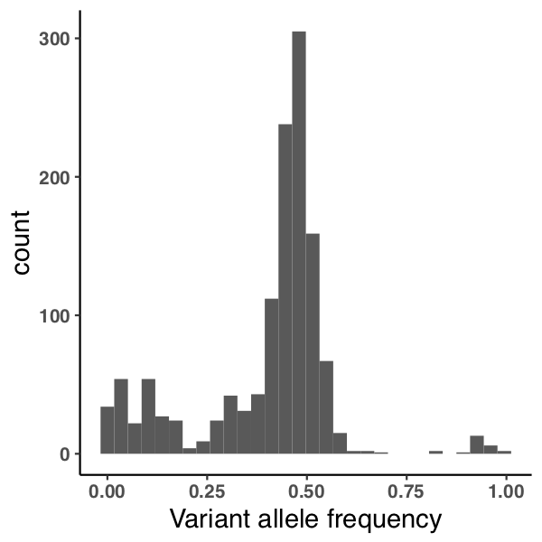

---
output:
    pdf_document:
        fig_caption: yes
---
# Introduction
- almost all recent work has been on the heuristic aspects of variant calling.
- very little attention to the statistical model, either in competition or development
- there is useful biology.....

# Results

## Sensitivity and specificity in simulated data
1. Brief description of simulations, see methods
2. Words about the figure
    - What is the linear regime in the Mutect ROC curves about?
    - Is it related to the uniform prior, and does it give a good explanation of the performance difference?

Experiment 2 is a 100X whole genome with ~29000 spiked variants, most of which are under 2% because of the way the simulation works.

Experiment 10 is a 100X whole genome with the same variants as Experiment 2, but with a uniform vaf distribution. Prior method is still better, but in the uniform scenario there are only a small fraction of the total variants that are challenging to call.

Experiment 9 is a whole exome that was supposed to have 1,7,11, but instead has a random set of signatures due to a bug

## Sensitivity in real data
We examined two validation datasets from real tumors. An acute myeloid leukemia whole genome was sequenced to average coverage of 365X, and over 200,000 mutations validated by deep sequencing, generating a set of "platinum" consensus calls for the tumor. In addition to the full dataset we also called mutations on two downsample datasets, one retaining 50% of the original reads and one retaining 25%. ROC curves were generated using the "platinum" calls as cases, and sites where validation sequencing depth was greater than 100X and no variant reads were found as controls. Both algorithms perform similarly and nowhere along the curve is the {what is the name of this thing} method below raw mutect calls. The {method} calls a higher fraction of platinum calls at every odds threshold, and is especially effective at the common threshold of 2:1 odds in favor of the mutation.

***Going to need a table of AUROCs in the supplement for this***

## Effect of odds threshold
1. As threshold goes to infinity you get mutect.
2. As threshold goes to zero you should also get mutect.
3. Observe very little difference in the middle

## Effect of number of mutations

1. How to approach this?
   - At what point does the empirical make more sense than the dirichlet.
   - I think never, they will converge
   - What is the stopping point with a low number of high confidence mutations
   - Implementation of the dirichlet should let us create an estimation of total error between the final empirical at a given threshold and the dirichlet at every point in the process. Maybe a plot of this?

## Effect of variant allele frequency distribution
1. TCGA data for different distributions.
   - Different cancer types?
   - Hypermutators vs. not?
   - This should only be related to the number of mutations that are confident and contribute to the prior
   - If that is the case, is there an analytical way to better describe this?

# Methods
VScode is great for markdown

# Figures

<!-- Figure 1 - aml31 no downsample roc

Figure 2 - aml31 no downsample fraction called

Figure 2a - aml31 no downsample vaf

Figure 3 - aml31 50 percent downsample roc

Figure 4 - aml31 50 percent downsample fraction called

Figure 4a - aml31 50 percent downsample vaf

Figure 5 - aml31 25 percent downsample roc

Figure 6 - aml31 25 percent downsample fraction called

Figure 6a - aml31 25 percent downsample vaf

Figure 7 - cell paper roc

Figure 8 - cell paper fraction called

Figure 8a - cell paper vaf

Figure 9 - experiment 2 roc

Figure 10 - experiment 2 fraction called

Figure 10a - experiment 2 vaf

Figure 11 - experiment 10 (uniform vaf) roc

Figure 12 - experiment 10 (uniform vaf) fraction called

Figure 12a - experiment 10 (uniform vaf) vaf

 -->