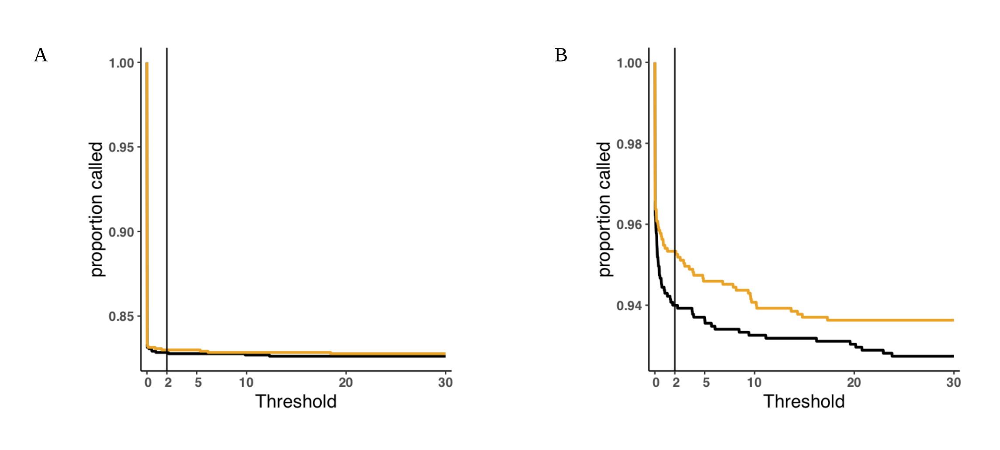

---
output:
    pdf_document:
        fig_caption: yes

bibliography: caller_paper.bib
---
# Targets
- Bioinformatics
- Plus Comp. Bio
- BMC bioinformatics
- Nature Scientific Reports.
- Genome Biology (published MuSE [@Fan2016])
- Nucleic Acids Research published EBCall in 2013

# Introduction

 Tumors are generally considered to arise from a single cell which acquires metastatic potential and is the ancestor of all cells in the tumor [@Nowell1976;@Fearon1989].
Clonal evolutionary processes are well studied in cancer [@Bozic2010;@Bozic2016], and the theory leads to three potential models for tumor evolution.
Tumors can evolve as a terminal expansion subject to little or no selective pressure, leading to a so-called *Big Bang* which is characterized by a large number of heterogeneous subclones[@Sottoriva2015].
Tumors evolving under selective pressure can have one of two dynamics: either they evolve in such a way that advantageous mutations arise and compete with each other leading to multiple dominant subclones in the tumor (branched evolution) [@Yates2012;@Gerlinger2012;@Burrell2013;@Bozic2016]; or they evolve such that each new advantageous mutation out-competes all previous mutations leading to a single dominant clone (sequential evolution) [@Hu2017].
These processes lead directly to the mutational profile of the tumor, i.e. mutations (variants), their genomic contexts, and their frequencies.

Identification of the mutations present in a tumor can be critical in optimizing the treatment regime for an individual patients disease [@Ding2012;@Mardis2012;@Chen2013;@Borad2014;@Findlay2016].
Low frequency mutations present a significant problem for current mutation calling methods because their signature in the data is difficult to distinguish from the noise introduced by NGS.
@Griffith2015 demonstrate conclusively that identification of all major resistance mutations present in a tumor is essentially impossible with current sequencing practice.
They find that rather than the current standard of sequencing a tumor exome at 75X-100X depth, sequencing of up to 400X is required to identify important subclonal mutations in a heterogeneous tumor.
In addition, they find that to identify the mode and tempo of evolution in a tumor, whole genome sequences of 300X are required [@Griffith2015].
Unfortunately, modern variant callers suffer from excessive false positive rates at extreme sequencing depths [@Cibulskis2013].
@Griffith2015 found that in order to generate a reliable set of variant calls for a whole genome sequenced at 312X depth they needed to combine the calls from eight different variant callers and then resequence 200,000 individual variants.
In this proposal I develop two methods; a novel variant calling algorithm with a significantly reduced false positive rate for deep sequencing data, and an algorithm that identifies the timing of one of the characteristic processes operating in tumor evolution.

We analyzed data from 2 real tumor studies and 6 simulations.
I am completely stuck for intro so I just copied in from the proposal and moved on.
One of the important things to get across here is that we are really generating a score, not a true odds.
MuTect2 was released with a TLOD threshold of 5.3, corresponding to posterior odds of .3 which is much less than one.

<!-- Cancer is an evolutionary process, and understanding initiation, progression, and metastasis will require applications of evolutionary theory.
One of the major tools in the evolutionary theory toolbox is the allele frequency spectrum.
This allele frequency spectrum is constructed from 

If tumors, as evidence suggests [@Williams2016;@Williams2018;@Bozic2016], evolve essentially neutrally, then even driver mutations can't be expected to rise to high frequency during tumor evolution.
As a result, finding mutations important to progression, resistance, and metastasis requires finding lower frequency mutations. (not really)
Finding 
Tumor heterogeneity has been associated with prognosis (1-4 in chuang paper) and the evolutionary trajectory helps identify the number of tumor subclones and their selective advantage.

The variant allele frequency spectrum that is currently used most often in cancer is truncated at a level above 5-10% because of difficulties in identifying low frequency variants.

- There are two main tracks in variant calling.
    - Heuristic filters
    - Statistical models of sequencing error
- We focus here on a model of mutation probability, including but not limited to sequencing error.
- Many types of callers, all assume there is no biological preference for mutation at a given site. Any site specific estimates are site specific sequencing/alignment error models[@Xu2018]. 
- Mutect2, FreeBayes and others are haplotype based callers
- Callers with site specific variant probabilities generate them either from other samples or through deep sequencing (deepSNV,EBCall,LoLoPicker). They are essentially generating a site specific sequencing error model, not a site specific probability of mutation
- Need to think about how the method applies to UMI (barcode) based sequencing, which are mostly deep targeted
MuSE is continuous time markov evolutionary model, still assuming no biological difference in site specific mutation probability[@Fan2016]
- very little attention to the statistical model, either in competition or development
- there is useful biology.....
    - [@Temko2018] links between mutational processes and driver mutations
    - [@VandenEynden2017] mutational signature critical for estimating selection
    - [@Kandoth2013;@Alexandrov2013a] Underlying mutational processes generate tumor and tumor type specific mutation signatures
- Rather than using a constant probability for mutation, as other variant callers do, we convert that to an average or expected mutation probability, and compute the probability conditional on context and genome composition
- Poisson models make similar assumptions about the probability of an allele at a site. (Illumina technical note https://www.illumina.com/Documents/products/technotes/technote_somatic_variant_caller.pdf).
- we simulate neutral tumor evolution, and assign vafs using a Beta(1,6) distribution
    - if M(f) is proportional to 1/f, then an exponential distribution is implied [@tarabichi2017;@Williams2017](and the answering note by De, which also has a strong argument about why we need lower frequencies to do evolutionary inference). We choose a beta distribution to draw vafs and tuned to achieve a slightly fatter distribution in the 2-5% range in which we are most interested.
- Need a list of why evolutionary inference on tumors is important. Resistance, virulence(heterogeneity), biology (mutation rate/signature/micro-environment).
 -->
# Results

## Sensitivity in real data
We examined two real tumor datasets in which variants had been validated by deep targeted resequencing [@Griffith2015;@Shi2018]. 
@Griffith2015 performed whole genome sequencing of an acute myeloid leukemia to a depth of ~312X, called variants with seven different variant callers and validated over 200,000 variants by targeted re-sequencing to a depth of ~1000X. This led to a platinum set of variant calls containg 1,343 SNVs. 
We obtained BAM files from this experiment and called variants using MuTect 1.1.7, then compared the sensitivity of the calls between MuTect and our method (Figure 1A). 
At any relevant threshold our method is slightly more sensitive than MuTect. MuTect is unable to recover 100% of the calls due to hueristic filtering and other differences between MuTect and the other variant callers used.

@Shi2015 performed multi-region sequencing of 6 breast tumors to evaluate the effects of variant calling and sequencing depth on estimates of tumor heterogeneity, validating 1,385 somatic SNVs.
As with the leukemia we obtained BAM files for this experiment and compared our method to raw MuTect calls (Figure 1B).
We again find that our method is more sensitive than MuTect across the full range of relevant thresholds.

***A) AML31 platinum SNV calls [@Griffith2015]. B) Validated SNV in 6 breast cancers[@Shi2018].***

## Sensitivity and specificity in simulated data
In order to describe the operating characteristics of our score as a classifier compared to MuTect, we simulated six tumors (see methods), three 100X whole genomes and three 500X whole exomes, with three differnent mutation spectra(methods).

***A-C) Whole exome simulation. D-F) Whole genome simulation.***

## Effect of number of mutations
We will have this from the difference between exome and wgs on the same vaf distribution and signature.
This is likely to have some signature dependence.
1. How to approach this?
   - At what point does the empirical make more sense than the dirichlet.
   - I think never, they will converge
   - What is the stopping point with a low number of high confidence mutations
   - Implementation of the dirichlet should let us create an estimation of total error between the final empirical at a given threshold and the dirichlet at every point in the process. Maybe a plot of this?

## Effect of variant allele frequency distribution
1. TCGA data for different distributions.
   - Different cancer types?
   - Hypermutators vs. not?
   - This should only be related to the number of mutations that are confident and contribute to the prior
   - If that is the case, is there an analytical way to better describe this?
   THE ONLY EFFECT IS ON THE ROC. EASIER DISTRIBUTIONS SHRINK THE EFFECT BECAUSE SO FEW ARE NEAR THE CRITICAL POINT

# Methods

## 
100X whole genome and 500X whole exome for each of three signatures

1,7,11 UV (Very concentrated at C>T)
1,4,5 Tobacco (Slight concentation at C>A and C>T)
1,3,5 Breast (diffuse)

All vafs will be from the beta(1,6) which is a fat exponential

# Figures

Figure 1 - aml31 no downsample roc

Figure 2 - aml31 no downsample fraction called

Figure 2a - aml31 no downsample vaf

Figure 3 - aml31 50 percent downsample roc

Figure 4 - aml31 50 percent downsample fraction called

Figure 4a - aml31 50 percent downsample vaf

Figure 5 - aml31 25 percent downsample roc

Figure 6 - aml31 25 percent downsample fraction called

Figure 6a - aml31 25 percent downsample vaf

Figure 7 - cell paper roc

Figure 8 - cell paper fraction called

Figure 8a - cell paper vaf

<!-- Figure 9 - experiment 2 roc

Figure 10 - experiment 2 fraction called

Figure 10a - experiment 2 vaf

Figure 11 - experiment 10 (uniform vaf) roc

Figure 12 - experiment 10 (uniform vaf) fraction called

Figure 12a - experiment 10 (uniform vaf) vaf

 -->

# References