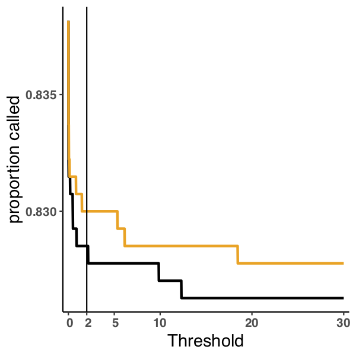
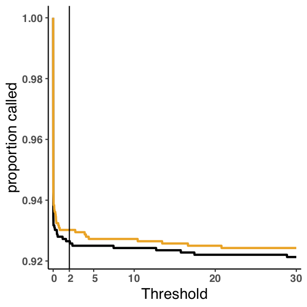

---
output:
    pdf_document:
        fig_caption: yes
---
# Results

## Sensitivity and specificity in simulated data
1. WGS and exome in one figure. ROC curves with points for 1, 2 and .3 odds cutoff.
   - Distribution of allele frequencies in the platinum. (How low are we calling at 92% and how low are the ones we can never get? Histograms and not density!)
2. Brief description of simulations, see methods
3. Words about the figure
    - What is the linear regime in the Mutect ROC curves about?
    - Is it related to the uniform prior, and does it give a good explanation of the performance difference?

## Sensitivity in real data
1. One figure with aml31 and new Cell paper
   - Sensitivity in platinum and gold data sets, with cutoffs for both
   - At what cutoff do you get all of the platinums
   - Is the new data good enough to do ROC curves?
2. Challenges of working with real data.

## Effect of number of mutations

1. How to approach this?
   - At what point does the empirical make more sense than the dirichlet.
   - I think never, they will converge
   - What is the stopping point with a low number of high confidence mutations
   - Implementation of the dirichlet should let us create an estimation of total error between the final empirical at a given threshold and the dirichlet at every point in the process. Maybe a plot of this?

## Effect of variant allele frequency distribution
1. TCGA data for different distributions.
   - Different cancer types?
   - Hypermutators vs. not?
   - This should only be related to the number of mutations that are confident and contribute to the prior
   - If that is the case, is there an analytical way to better describe this?

# Methods
VScode is great for markdown

# Figures
Figure 1 - aml31 no downsample roc

Figure 2 - aml31 no downsample fraction called

Figure 3 - aml31 50 percent downsample roc

Figure 4 - aml31 50 percent downsample fraction called

Figure 5 - aml31 25 percent downsample roc

Figure 6 - aml31 25 percent downsample fraction called

