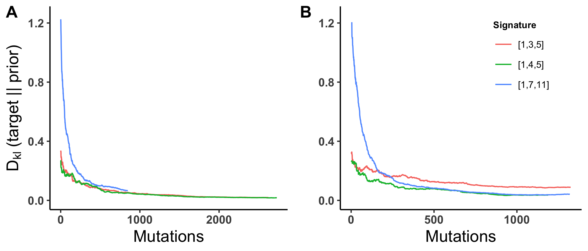
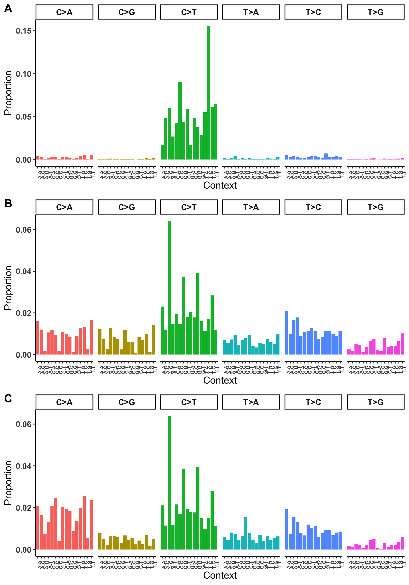

# Introduction

Variant callers are statistical classifiers.
Usefulness of any classifier is a combination of the ranking performance of the classifier, and the quality of decisions based on the classifier in the real world.
Here we describe an empirical Bayes method which uses very high confidence variant calls from MuTect to create a biologically inspired prior probability of mutation based on the mutation spectrum of the tumor.
We use realistic tumor simulations to show that this method is superior to MuTect as a classifier based on AUROC, while equal or inferior to MuTect based on AUPRC.
The model above is poorly calibrated, so we use estimates of the mutation rate and the distribution of allele frequencies under the null hypothesis.
These estimates rely only the well-supported assumption that after initiation the tumor is evolving essentially neutrally.
We show that the model is well-calibrated with this full estimate of the posterior distribution.

# Somatic variant calling base probability model

At every site in the genome with non-zero coverage, Next Generation Sequencing (NGS) produces a vector $\mathbf{x}  = (\{b_i\},\{q_i\}), i = 1\dots D$ of base calls and their associated quality scores, where $D$ is total read depth.
The goal is to use $\mathbf{x}$ to select between competing hypotheses;
$$
\begin{array}{l}
\mathbf{H_0}:\quad \textrm{Alt allele} = m;\quad\nu = 0\\
\mathbf{H_1}:\quad \textrm{Alt allele} = m;\quad\nu = \hat{f},
\end{array}
$$
where $\nu$ is the variant allele frequency, $\hat{f}$ is the maximum likelihood estimate of $\nu$ given data $\mathbf{x}$, i.e. the ratio of the count of variant reads and total read depth, and $m$ is any of the 3 possible alternate non-reference bases.
For a given read with base $b_i$ and q-score $q_i$, the density function under a particular hypothesis is defined as

Making the common assumption that NGS reads are independent, the posterior probability of a given hypothesis, $P(m,\nu)$ is 
$$
  \begin{array}{cr}
    P(m,\nu) = &p(m,\nu) \cdot $\mathcal{L}_{m,\nu}(\mathbf{x}). \\
             = &p(m,\nu) \cdot \prod_{i=1}^{D} \textrm{f}_{m,\nu}(x_i),
  \end{array}
$$
where the density \textrm{f}_{m,\nu}(x_i) is
$$
  \textrm{f}_{m,\nu}({b_i,q_i}) = \left\{
    \begin{array}{cr}
      \nu \frac{10^{-q_i/10}}{3} + (1-\nu)(1-10^{-q_i/10}) & b_i = \textrm{reference}\\
      \nu(1-10^{-q_i/10}) + (1-\nu) \frac{10^{-q_i/10}}{3} & b_i = m\\
      \frac{10^{-q_i/10}}{3} & otherwise.
    \end{array}
    \right.
$$

Assuming that the identity of the alternate allele and the estimated allele frequency are independent of each other, and $\nu$ is uniformly distributed results in the final model
$$
  P(m,\nu) = p(m) \times $\mathcal{L}_{m,\nu}(\mathbf{x}).
$$

# Site-specific prior probability of mutation

The probability which we have denoted $p(m)$ for compactness above is actually the joint probability that a mutation has occured $M$, and that it was to allele $m$, which we will denote here $p(m,M)$.
However, $p(m,M)$ is not constant for every site in the genome, and follows a distribution -- conditional on the genomic context surrounding the site -- described by the mutation signature of the tumor and denoted $p(m,M | C)$(citations).
The prior probability $\mathrm{p}(m,M \mid C)$ can be decomposed as
$$
\mathrm{p}(m,M \mid C) = \mathrm{p}(C \mid M,m) \frac{p(m,M)}{p(C)}
$$
\bkmcomment{This is a problem. I am having trouble with the fact that C includes m. Maybe $p(C | M)$}

While variant calling algorithms typically assume a constant probability of mutation at every site in the genome, work by Alexandrov and others show that the random mutation generating process actually varies from site to site in a nucleotide context specific manner.
We develop a model of the prior probability of mutation to allele $m$ conditional on the observed genomic context $\mathrm{p}(m,M \mid C)$, and demonstrate an empirical Bayes method for computing this probability from MuTect output.
The prior probability $\mathrm{p}(m,M \mid C)$ can be decomposed as
$$
\mathrm{p}(m,M \mid C) = \mathrm{p}(m \mid C) \mathrm{p}(M \mid C) = \mathrm{p}(m \mid C) \mathrm{p}(C \mid M)\frac{p(M)}{p(C)}
$$
since the probability of a mutation at a site and the probability that it is to allele $m$ are independent conditional on the context.
Here $\mathrm{p}(M) = \mu$ as above, and the empirical distribution of contexts $\mathrm{p}(C)$ is the fraction of the genome made up of each context.
We model $\mathrm{p}(C \mid M)$ as a multinomial distribution with parameter $\boldsymbol{\pi} = \{\pi_i\}, i = 1\dots96$.
Mutations are drawn from this multinomial distribution such that $\mathrm{p}(C = i \mid M) = \pi_i$.
The final quantity $\mathrm{p}(m \mid C)$, the probability of mutation to $m$ given a particular three letter context, is a function of $\boldsymbol{\pi}$. 
We are left to estimate only the vector of probabilities $\boldsymbol{\pi}$.

\[
\begin{aligned}
C \mid M,\boldsymbol{\pi} & \sim \textrm{Multinomial}(\boldsymbol{\pi})  \\
\boldsymbol{\pi} \mid \boldsymbol{\alpha} &\sim \textrm{Dirichlet}(\boldsymbol{\alpha}).
\end{aligned}
\]

The posterior distribution of $\boldsymbol{\pi}$ is $\boldsymbol{\pi} \mid C,\boldsymbol{\alpha} \sim \textrm{Dirichlet}(\mathbf{C} + \boldsymbol{\alpha})$, where $\mathbf{C} = (C_1,\dots,C_{96})$ are the counts of mutations present in the tumor for each of the 96 contexts.
We compute an empirical bayes estimate of $\boldsymbol{\pi}$ by choosing $\mathbf{C}$ as the set of mutations assigned a TLOD by MuTect above some threshold, which we choose as 10.
We show through extensive simulation that our estimate of $\boldsymbol{\pi}$ converges quickly its true simulated value.

Returning to the model above, we can calculate the log posterior odds in favor of $\mathbf{H_1}$ as

\[
  \textrm{log}_{10} \left(\frac{(\mathcal{L}_{\nu=\hat{f},m}(\mathbf{x})\mathrm{p}(m,M \mid C)}{(\mathcal{L}_{\nu=0,m}(\mathbf{x})(1-\mathrm{p}(m,M \mid C))} \right) = \textrm{TLOD} + \textrm{log prior odds},
\]

and the posterior odds ratio in favor of $\mathbf{H_1}$ as
\[
10^{(\textrm{TLOD} + \textrm{log prior odds})}.
\]

We show via extensive simulation that under the assumption that the mutation signature describes the biological process generating mutations in a tumor, our posterior odds ratio is a better classifier than MuTect at any threshold.
Unfortunately, this increased classification performance comes at a cost in terms of calibration, The probabilities from this model are substantially worse than those from Mutect, such that threshold selection is essentially impossible and precision/recall is substantially worse for this model.
There are several distributional assumptions in this model that effect model calibration, and we address all of them below.

# Estimating the mutation rate from the data

As discussed above, MuTect fixes the site-specific mutation probability at $\mathrm{p}(M)= \mu = 3\mathrm{e}{-6}$.
All variant callers we are aware of either fix this parameter $\mu$ or allow the user to input the value, but there is no way to really know this value until the variant allele frequencies have been observed.
As with estimation of the mutation signature, we can use high confidence mutations and a model of tumor evolution to compute the tumor-specific mutation rate.
@Bozic2016 show that for any variant allele frequency $\alpha$, the total number of mutations with frequency greater than $\alpha$ and less than $0.25$ is

$$
N(\alpha) = N\mu \left( \frac{1}{\alpha} - \frac{1}{0.25} \right)
$$

Where $N$ is the total number of sites sequenced and $\mu$ is the per-site mutation probability.
By selecting $\alpha$ such that we are highly confident in all calls at frequencies greater than $\alpha$, we can compute $\mu$ and recompute the odds in favor of $\mathbf{H_1}$.
This improves the calibration of the model, but it is still worse than MuTect.
The final assumption embedded in the model is that all variants, regardless of allele frequency, have the same prior probability of being true variants.
Below we address this assumption.

# False positive rate control

We develop a method, following @Efron2008, for controlling the false positive rate.
Every site with sufficient coverage and at least 1 alternate read falls into one of two classes, they are either *null* (non-variant with $\nu = 0$) or *nonnull* (variant with $\nu = \hat{f}$) with prior probabilities $p_0$ and $p_1 = 1-p_0$,

$$
\begin{array}{ll}
p_0 = \textrm{P}\{\textrm{null}\} \quad & \textrm{f}_{0}(\mathbf{x}) \quad \textrm{density if null}\\
p_1 = \textrm{P}\{\textrm{nonnull}\} \quad & \textrm{f}_{1}(\mathbf{x}) \quad \textrm{density if nonnull} .
\end{array}
$$

The local, or site-specific, true positive probability $p_1$ can be estimated as the fraction of all sequenced sites that are expected to be positive.
In a neutrally evolving tumor, the number of cells is growing exponentially, and the count of variants with an allele frequency greater than a given allele frequency $f$ is [@Bozic2016,@Williams2016a]
$$
N(f) = \frac{N\mu}{f},
$$
Where $N$ is the total number of sites sequenced and $\mu$ is the per-site mutation probability.
The estimated fraction of all of the sites in the genome that will have a mutation with frequency $f$ is
$$
\hat{p}_1 = \frac{\int_{f_{-}}^{f_{+}} N(f)}{N} = \frac{\mu}{f - .1f} -  \frac{\mu}{f + .1f}
$$
and the estimated null probability $\hat{p}_0 = 1 - \hat{p}_1$.
@Williams2016a provides a full derivation for this, we are essentially computing the integral here of $N(f)$ in a small area around $f$.

# Results

Figure 1 shows that the calibration is better than MuTect or the model without false positive rate control.
In addition estimation of mu from the data results in better calibration than assuming a mis-specified rate.

# Figures

# References

